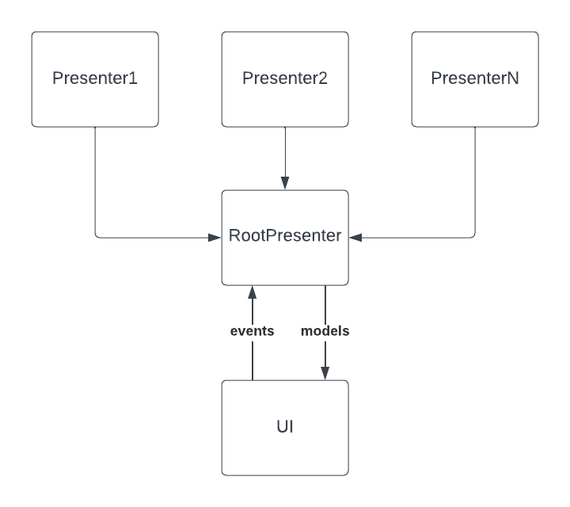

# umob hiring assignment
For more information on the assignment see [https://github.com/umob-app/hiring-assignment]

## Getting Set up.
- Pull this repo
- The easiest way to run is to install Android Studio. You can find it here. [https://developer.android.com/studio]

## Architecture
The architecture vaguely follows an Model-View-Presenter (MVP) paradigm. 
- We follow the standard Android "repository" pattern for our data layer.
- In this app we use Molecule, which leverages the compose runtime, to build composable Presenters. These drive all the functionality of the app by emitting models. Models inform the UI. 
- The view layer is built using Compose UI.

I chose to use Android because it is what I work in on a day to day basis; therefore I can follow some known patterns and implement things quickly. I combined things I am familiar with, like molecule, 
with some things that are pretty new to me, like Compose UI.

## Things I would change
I left a number of comments and TODOs throughout the codebase to mark things that need improving. The UI needs a lot of work and could be made much much nicer if I had time. I also had to cut some corners
on the requirements to meet the time limit, so I would go back and address these issues before doing anything else. I would also like to add more questions. I have a pretty limited set at the moment which serve as a POC.

If I had extra time to work on this I would like to add an interactive map so the user can see and explore the data we are quizzing them about.

From a technical perspective I would address some of the gaps in the DI container so that I could further decouple the app navigation framework from the Presenters. 